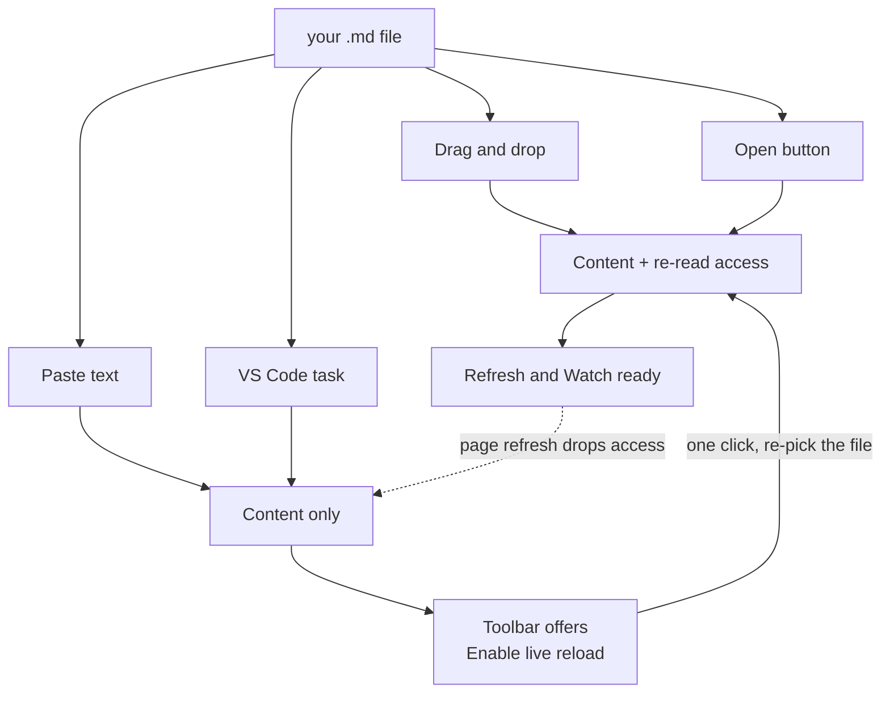

# Eye Love Markdown Viewer

*The most powerful light Markdown viewer in the world. One HTML file, ~92 KB, nothing
to install.*

**Every other Markdown viewer is built to render the file. This one is built so you
can read it.**

None of them seem concerned with your eyes — whether the type is a size you can
comfortably take in, whether the contrast suits the room you're sitting in, whether
you can shape the page the way *you* want. They render correctly and consider the job
done.

And you're stuck with whichever one you've got: the preview pane bolted into your
editor, the renderer on a website, the viewer inside your notes app. Each hands you
one fixed appearance, a fraction of the capabilities you actually want, and no say in
either.

## Made for reading

**Text that scales without the page falling apart.** Most viewers give you one size
and a zoom that enlarges the entire interface — the toolbar grows along with the text,
the layout reflows, tables break, and you end up with *fewer* words on screen than you
started with. This scales the **document**, 65% to 260%, and leaves the furniture
alone. More words, same layout, nothing rearranged.

**Contrast you choose.** Twelve palettes across light and dark, every one
contrast-validated rather than eyeballed: body text holds 12:1 or better in all
twelve. **Bold all** thickens the body text for glare and low-contrast screens. Dark
mode dims images, so a white-background screenshot stops being a flashbulb.

**It remembers.** Size, palette and layout persist between sessions, and the page
opens already themed instead of flashing white and correcting itself.

## Made for working

**Keep your editor — use this as the preview.** Turn on **Watch** and the viewer
re-reads the file every time you save. Write wherever you like, on one half of the
screen, and see the formatting land in a reader set up for your eyes: no preview pane
fighting you for space, no second rendering engine disagreeing with the first. Or
leave it off and hit `↻` when you want it. *(Chromium browsers — elsewhere the buttons
simply aren't there and everything else works.)*

## Markdown in, HTML out

Reading is half of it. The other half is turning the document into something you can
send to anyone.

**Export** writes a single self-contained `.html` file. Every style is inlined — the
palette you picked, your text size, bold-all, image dimming — so it opens looking
exactly like what was on your screen, in any browser, with no stylesheet, no font and
no script to fetch. Mermaid diagrams travel as already-rendered SVG, so they appear
for someone who has never heard of Mermaid. The copy buttons are stripped.

**There are no `<script>` tags in the output at all.** That matters more than it
sounds: the result can be emailed, dropped into a wiki or SharePoint, or opened on a
machine with scripting locked down, and it still renders exactly the same.

`Ctrl+P` gives you a PDF instead. Printing reverts to 11pt on white whatever theme you
were reading in, so the page reads properly on paper rather than emerging as a dark
rectangle.

And all of it happens on your machine. Converting Markdown to HTML normally means
installing a toolchain or pasting your document into somebody's website — which stops
being an option the moment the content is confidential. Nothing here leaves the
browser.

## Nothing to install, nothing to approve

No install. No server. No build step, no toolchain, no `node_modules`. **Nothing in
the package is executable** — no installer, no script, no launcher — so there is
nothing for a mail gateway to strip, SmartScreen to warn about, or policy to block,
and nothing to raise a ticket for. The people who most need a readable Markdown viewer
are often exactly the people who can't get one approved.

Download the folder, double-click the HTML file, drop a `.md` on it. Bookmark it to
your toolbar and it behaves like a browser add-on.

## Why one file can do this

It feels like a real application because, in every way that matters, it is one. Your
browser stopped being a document viewer a long time ago — it's an application platform
now, with a rendering engine, a fast JavaScript runtime, storage that remembers your
settings between visits, and, in Chrome and Edge, permission to re-read a file once
you've pointed it at one. That is everything an app needs, and it is already installed.

Software with this feature set normally arrives as a 150 MB Electron bundle: an
installer, an auto-updater, and a private copy of Chromium. Nearly all of that weight
is the engine. You already have the engine — so this is only the part that would have
been wrapped inside it.

The trade is real but narrow. A page can't reach into your filesystem unprompted, run
in the background, or add itself to your right-click menu. For a document reader those
cost nothing: you hand it a file, it shows you the file. That's why the approach fits
*this* problem and would be the wrong one for, say, a file manager.

## Use it

1. Download this folder (GitHub → **Code → Download ZIP**, or `git clone`), or unzip
   the package someone sent you.
2. Double-click `md_to_html_viewer.html`. It opens in your browser.
3. Get a document in by any of:
   - **Drag & drop** a `.md` anywhere on the window. Drop the Markdown *and* its
     images together and relative image links resolve.
   - **Drop a folder** — every `.md` inside becomes a list in the sidebar. See
     [Reading a whole project](#reading-a-whole-project) below.
   - **Open** button (`Ctrl+O`).
   - **Paste** Markdown text straight onto the page (`Ctrl+V`).

## Reading a whole project

A project's Markdown is rarely one file. There's a README, a CHANGELOG, notes,
half-finished specs, and whatever the AI wrote last week — and reading them means
opening each one and losing your place in between.

**Drop the folder on the window.** Every `.md` inside it is collected into a
**Documents** list at the top of the sidebar, sorted with root files first and each
`README` at the head of its folder. Click any of them to read it; the contents
sidebar rebuilds for whatever you're on. Nested folders are shown under the filename,
so two files both called `README.md` stay tellable apart.

Nothing is written anywhere. There's no manifest to maintain, no config file, no
index to regenerate when you add a document. The set lives for the life of the tab —
close it and nothing is left behind.

`node_modules`, `dist`, `build`, `target`, `vendor` and dotted directories like
`.git` are skipped; walking a project root without that takes long enough to look
like a hang. The walk stops at 8 levels deep or 500 documents, whichever comes first.

> Dropping a folder needs the File System Access API, so it's Chromium-only
> (Chrome, Edge) — as is the **Open a folder…** item in the **⋮** menu. Everywhere
> else, selecting several `.md` files and dropping them together builds the same
> list.


### From VS Code

`.vscode/tasks.json` in this repo defines an **Open in MD Viewer** task that opens
whatever file is in the active editor tab. Bind it in your user `keybindings.json`:

```json
{ "key": "ctrl+m down", "command": "workbench.action.tasks.runTask",
  "args": "Open in MD Viewer" }
```

That is a **chord**: press `Ctrl+M`, release, then `Down`. Only `Ctrl`, `Shift` and
`Alt` can combine with a key in a single stroke, so `m` and `Down` cannot both be
part of one press. It also takes over `Ctrl+M`, which VS Code otherwise uses to
toggle tab focus mode.

The task is workspace-scoped. To use it in any folder — an Obsidian vault, say —
copy the task into your user-level tasks file via **Ctrl+Shift+P → Tasks: Open User
Tasks**.

The task runs a short PowerShell command inline, so nothing executable has to be
installed or trusted. The document arrives without re-read access, so
live reload starts disarmed and each press opens a new tab. If you'd rather stay on
one file and watch it, dragging the file from VS Code's Explorer onto the viewer
window arms live reload automatically and replaces the current document instead.

**Arming live reload quickly.** Clicking **Enable live reload** copies the source
path to your clipboard before opening the dialog, so you can paste it straight into
the File name box (`Ctrl+V`, `Enter`) instead of navigating the tree. The picker
cannot be pointed at a file directly — browsers deliberately forbid preselecting
one — but after the first pick in a session the dialog reopens in the same folder.

> **Keep `vendor/` next to the HTML file.** Mermaid is loaded by relative path, so
> moving the HTML out of this folder on its own breaks diagram rendering. Everything
> else still works.

### How a document gets in

All four routes render identically. They differ in one thing: whether the browser
also hands over permission to **re-read the file**, which is what `↻ Refresh` and
`Watch` need.



That dotted line is the one surprise: a page refresh always discards re-read
access, because `file://` pages cannot store it. Re-arming is a browser
restriction, not a bug — see below.

## What it does

- **GitHub-Flavored Markdown** — tables, task lists, strikethrough, autolinks, fenced
  code, plus footnotes, definition lists, and YAML front matter.
- **Mermaid diagrams** — ` ```mermaid ` fences render as diagrams, offline.
- **Syntax highlighting** for JS/TS, Python, HTML/XML, CSS, JSON, Bash, SQL, YAML,
  TOML/INI, and diffs.
- **Contents sidebar** with scroll-spy, and per-block copy buttons.
- **Document set** — drop a folder (or several `.md` files) and the sidebar lists
  every document, click to move between them. No manifest, nothing written to disk.
- **Source path** — click the filename in the toolbar for a selectable field and a
  **Copy** button. Opening via the VS Code task shows the full
  path; drag & drop, the file picker and paste can only show the filename, because
  browsers never reveal full paths to a web page.
- **Text size** — `A−` / `A+` scale the document from 65% to 260%. Unlike browser
  zoom this leaves the toolbar and sidebar alone, so you get more words on screen
  rather than a magnified interface. Diagrams and code blocks scale with the text.
- **Bold all** — `B` thickens the body text for glare or low-contrast screens.
  **Bold** stays visibly heavier than its surroundings.
- **Twelve palettes** — pick a **mode** (Light / Dark), a **colour family**, and a
  **depth**. Light offers White and Beige (built on warm ivory neutrals);
  Dark offers Blue and Slate. Depth steps the background darker within the chosen
  family. Family and depth are remembered per mode, so flipping Light ⇄ Dark
  returns you to the look you last chose for it. Tick **Match system** to let the
  OS choose the mode — picking a mode by hand releases it again. Dark mode also
  desaturates and dims images so white-background screenshots stop glaring;
  diagrams re-render in their own dark theme.

  Every palette is contrast-validated rather than eyeballed: body text holds 12:1
  or better in all twelve, and table rules stay visible against every background.
- **Export** to a standalone HTML file, or `Ctrl+P` for a clean PDF. Exports keep
  your chosen text size; printing always reverts to clean 11pt on white.
- **Refresh / Watch** (Chromium browsers) — `↻` re-reads the file from disk in one
  click. **Watch** flips to a pulsing **Live** dot and auto-reloads whenever the file
  changes, so you can edit in your usual editor and just look at the browser.

> **Drag & drop arms live reload automatically** in Chromium browsers — a dropped
> file carries re-read access with it, so `↻` and **Watch** light up immediately.
> Loading by **paste** or reopening a remembered document can't carry that access,
> so the toolbar offers **Enable live reload** instead: one click, re-pick the file,
> and watching starts. The grant can't be saved across a page refresh (`file://`
> pages are blocked from IndexedDB), so re-arming after a reload is a browser
> restriction, not a bug.

Raw HTML in Markdown is escaped by default. The **HTML** button opts in, and even then
everything passes through a tag/attribute allow-list, so scripts and event handlers are
stripped.

## Keyboard

| Key | Does |
|:--|:--|
| `+` / `-` | Bigger / smaller text |
| `0` | Reset text size to 100% |
| `B` | Toggle bold-all |
| `D` | Toggle light / dark mode |
| `Ctrl+O` | Open a file |
| `Ctrl+R` | Re-read the file from disk |
| `Ctrl+F` | Browser's own find — deliberately not overridden |
| `Ctrl` `+` / `-` | Browser zoom, which scales the whole interface |

Text-size keys are intentionally unmodified so `Ctrl` `+`/`-` stays with browser zoom.
All preferences persist across sessions.

## Browser support

Any current browser. Drag & drop, paste, and the file picker work everywhere. The
**Reload** and **Watch** buttons use the File System Access API and appear only in
Chromium browsers (Chrome, Edge); elsewhere they're hidden and everything else works.

## Updating Mermaid

No package manager. Download the single dist file straight into `vendor/`, replacing
what's there:

```
https://unpkg.com/mermaid@11/dist/mermaid.min.js
```

## Layout

```
md_to_html_viewer.html    the whole viewer — parser, highlighter, UI
vendor/mermaid.min.js     vendored Mermaid (MIT)
README.md  LICENSE
```

That is the entire package. **Nothing in it is executable** — no installer, no
script, no launcher. Mail gateways don't strip it and SmartScreen has nothing to
warn about, which matters because the machines most likely to need this tool are
the ones most locked down.

Mermaid is MIT licensed; see the header of `vendor/mermaid.min.js`.
